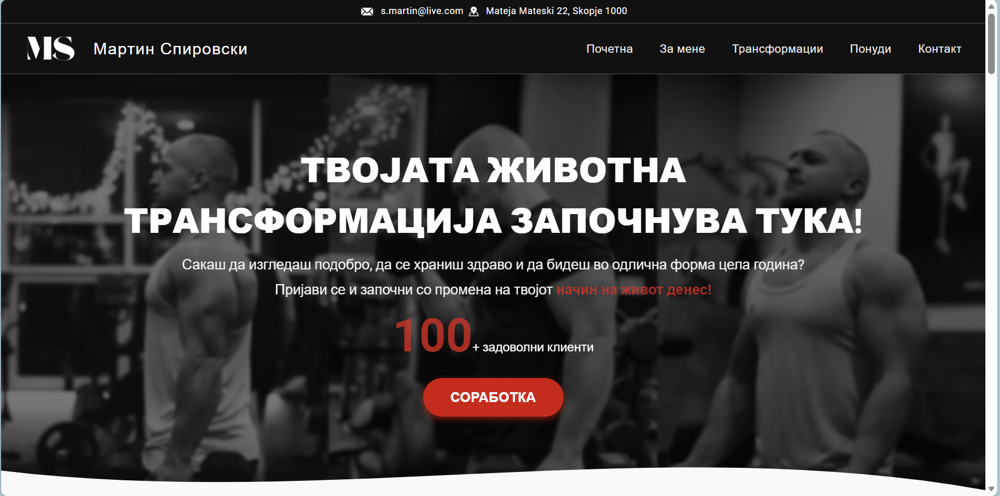
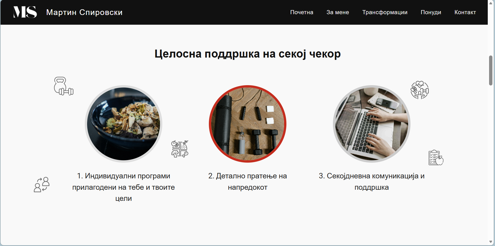
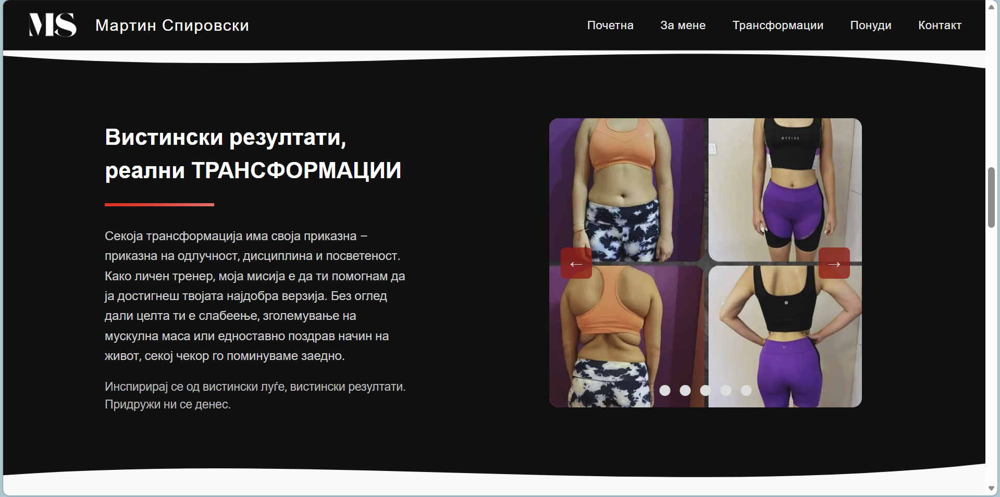
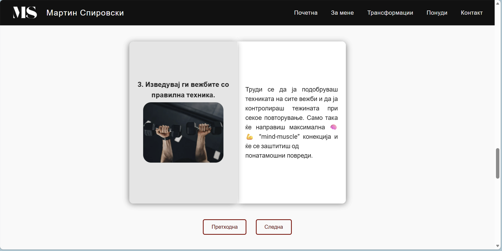
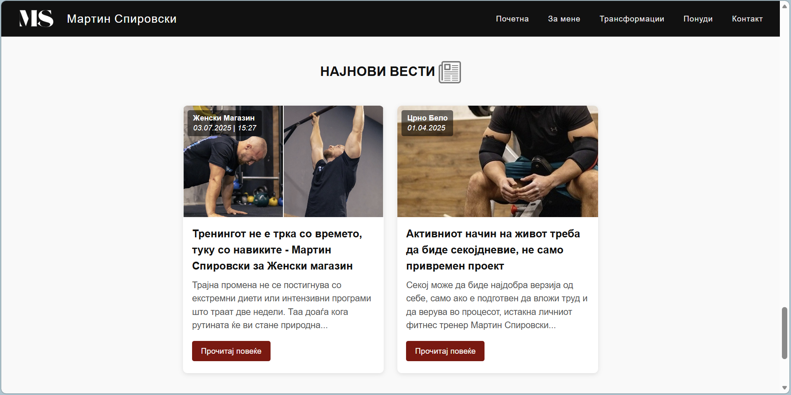

# martinspirovskifitness
# 🏋️ Martin Spirovski Fitness – Official Website

Welcome to the official website project for **Martin Spirovski Fitness**.  
This project was created to deliver a **modern, visually appealing, and engaging user experience** for visitors interested in fitness, personal training, and a healthy lifestyle.

🌐 **Live website:** https://martinspirovski.com

---

## Overview

This is a **fully front-end web project** built exclusively with **HTML, CSS, and JavaScript**.  
The website was designed specifically for a professional fitness trainer, with a strong focus on **user interface design, user experience, and visual storytelling**.

The main goal of this project is to attract potential clients, clearly present services, and encourage interaction through a clean and dynamic design.

---

## 🎯 Key Objectives

- Create a strong first impression 
- Highlight the trainer’s expertise and fitness services  
- Encourage user actions through clear call-to-action elements  
- Provide a smooth and intuitive experience across all devices  

---

## 🚀 Features

-  Fully responsive design (mobile, tablet, desktop)
-  Carefully selected color palette, typography, and imagery
-  Interactive elements such as counters, modals, and CTA buttons
-  Smooth scrolling and clear navigation
-  High-quality visuals that enhance motivation and engagement
-  Subtle animations and effects for a modern UI/UX feel

---

## 🛠️ Technologies Used

- **HTML5** – semantic structure and content
- **CSS3** – layout, responsiveness, animations, and styling
- **JavaScript** – interactivity and dynamic behavior
- **UI design templates** – improved consistency and usability
- **Custom images and branding elements**

---

## 🖼️ Screenshots

Here are some highlights of the website design:

| Home Page | Services | Transformation Stories | Nutrition Tips | News Articles |
|-----------|---------|-------|----------------|----------------------|
|  |  |  |  |  |

---

## 📬 Contact

For inquiries, feedback, or permission requests:

📧 **boninaumovska11@gmail.com**
